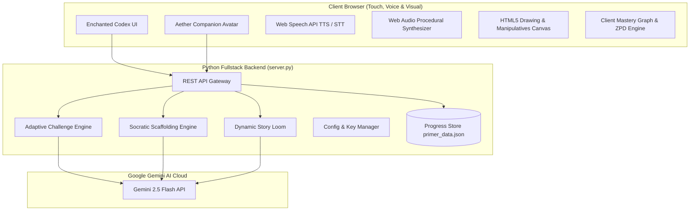
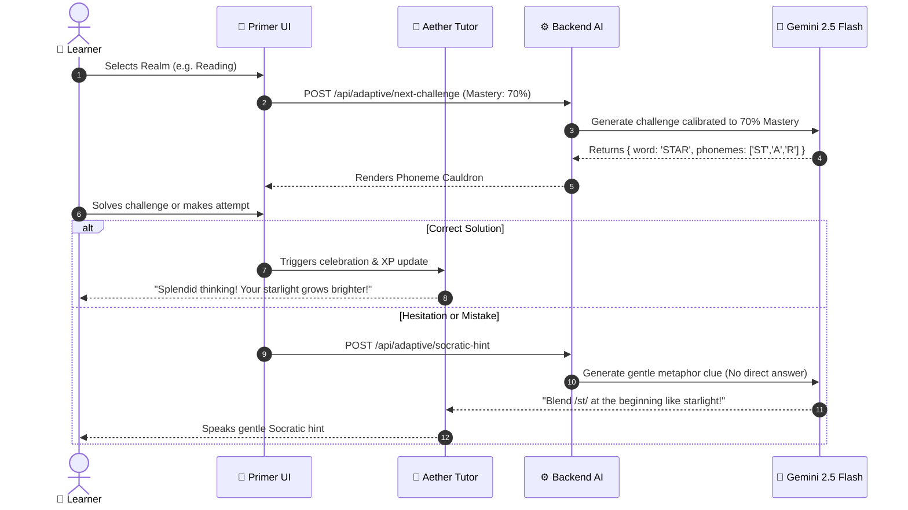

# 🏛️ The Primer: System Architecture & Technical Design

> *"Inspired by Neal Stephenson's The Young Lady's Illustrated Primer in The Diamond Age."*

---

## 🌟 Executive Overview

**The Primer** is an adaptive, multimodal, and emotionally intelligent AI private tutor web application designed for young children (ages 4–11). It combines real-time generative intelligence (powered by Google Gemini 2.5 Flash), zero-dependency procedural audio synthesis, HTML5 Canvas touch-drawing, and an adaptive cognitive mastery engine.

---

## 🏗️ High-Level System Architecture

---

## 🧩 Core Subsystems & Components

### 1. 📖 The Scribe's Haven (Reading & Phonics Engine)
- **Phoneme Cauldron**: Parses words into phonemic components (CVC, Blends, Magic E, Multi-syllable), rendering draggable runes that trigger audio feedback upon contact.
- **Living Storybook**: Dynamic multi-page interactive reader with syllable breakdown and speech recognition read-aloud verification.
- **AI Story Loom**: Generates structured JSON multi-page storybooks tailored to the child's chosen theme, character name, and reading level.

### 2. ✍️ The Runecrafter's Workshop (Handwriting & Penmanship)
- **Stardust Canvas Engine**: Captures high-frequency pointer and touch events, rendering quadratic Bezier curve strokes with glow effects.
- **Stroke Accuracy Evaluator**: Compares drawn coordinates against predefined guide star checkpoints.
- **Co-Author Story Weaver**: AI dialogue oracle that collaboratively writes continuing chapters with the child.

### 3. 🔢 The Chrono-Alchemist's Spire (Mathematics & Spatial Logic)
- **Ten-Frames**: Visual subitizing grid for base-10 number sense.
- **Balance Scale of Truth**: Physics-calculated visual algebra with rotational beam physics.
- **Cosmic Fraction Slicer**: Real-time geometric slice calculation ($1/2, 1/3, 2/4, 3/4$).
- **Number Line Rover**: Discrete position hopping for addition and subtraction.

### 4. 🦉 The Soul of the Primer (AI Socratic Companion)
- **Patience & Frustration Detector**: Tracks dwell times and rapid incorrect clicks. Automatically triggers **Starlight Breathing** interludes when cognitive fatigue is detected.
- **Socratic Guidance Ladder**: Tiered hints (Level 1: Story Metaphor $\rightarrow$ Level 2: Visual Scaffolding $\rightarrow$ Level 3: Step-by-Step Resolution).
- **"Ask Aether Anything"**: Conversational voice & text Q&A with Gemini.

---

## 🔄 Adaptive Learning Flow & Zone of Proximal Development (ZPD)

---

## 🔒 Security & Privacy Architecture
- **Secret Isolation**: All API keys and environment variables are strictly loaded on the backend via `.env` or `config.json` and never exposed to the client.
- **Offline Self-Sufficiency**: If offline or without an API key, the system automatically falls back to an internal procedural adaptive engine with 100% uptime.
